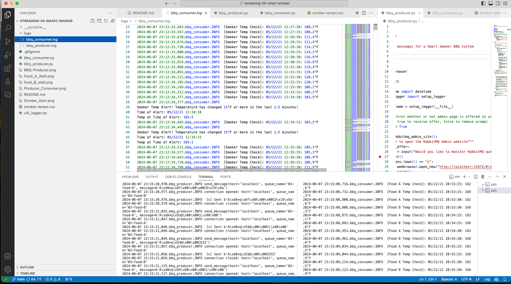
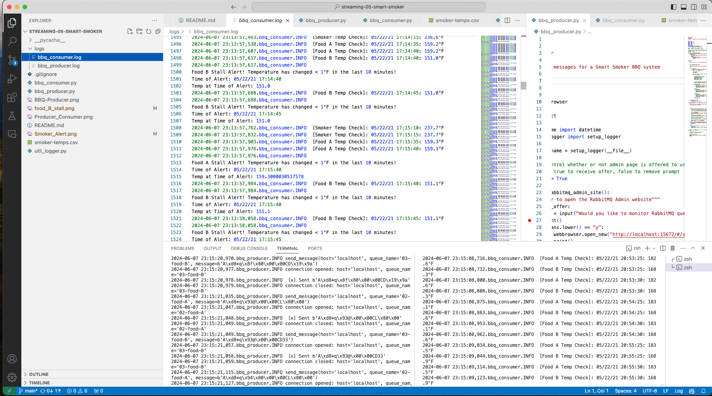
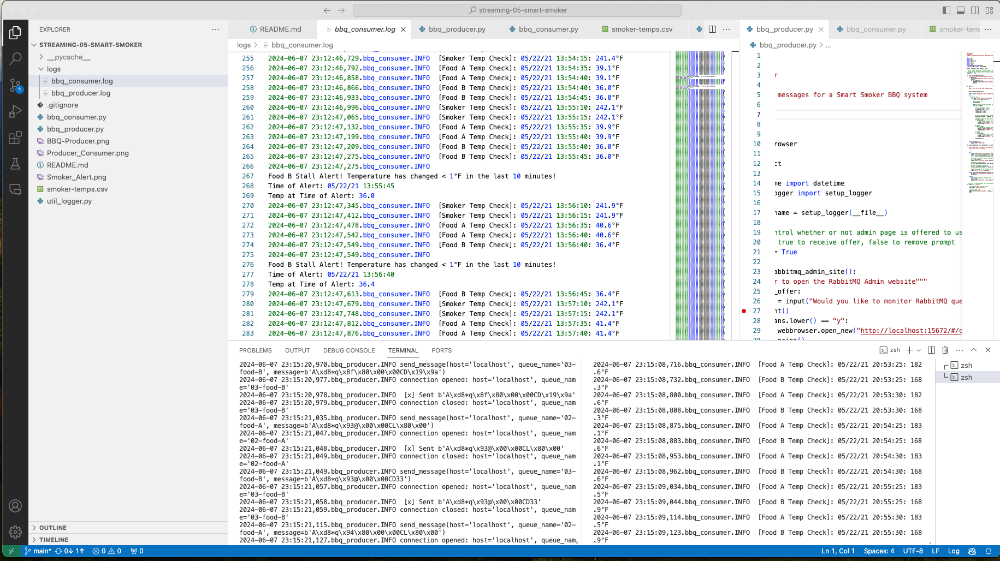

# streaming-05-smart-smoker
Module 5 of Streaming Data: Creating a Producer
Author: Levi Lowther
Created: 27May2024

## A Smart Smoker that Monitors Temperature
> In this module we create a producer of messages that reads from a CSV.
> These messages are read and sent to a queue that will be read later on.  

> In the second half of this we created a consumer that monitored the three queues we set up in the producer. And send messages based on the temperature readings and creates alerts when certain condtions are met. 

## Requirements
 > RabbitMQ server running pika installed in your active environment RabbitMQ Admin See http://localhost:15672/Links to an external site.
 > Python 3.12

## Guided Producer Design
1. If this is the main program being executed (and you're not importing it for its functions),
2. We should call a function to ask the user if they want to see the RabbitMQ admin webpage.
3. We should call a function to begin the main work of the program.
4. As part of the main work, we should
    1. Get a connection to RabbitMQ, and a channel, delete the 3 existing queues (we'll likely run this multiple times), and then declare them anew. 
    2. Open the csv file for reading (with appropriate line endings in case of Windows) and create a csv reader.
    3. For data_row in reader:
        1. [0] first column is the timestamp - we'll include this with each of the 3 messages below
        2. [1] Channel1 = Smoker Temp --> send to message queue "01-smoker"
        3. [2] Channe2 = Food A Temp --> send to message queue "02-food-A"
        4. [3] Channe3 = Food B Temp --> send to message queue "02-food-B"
        5. Send a tuple of (timestamp, smoker temp) to the first queue
        6. Send a tuple of (timestamp, food A temp) to the second queue
        7. Send a tuple of (timestamp, food B temp) to the third queue 
        8. Create a binary message from our tuples before using the channel to publish each of the 3 messages.
5. Messages are strings, so use float() to get a numeric value where needed
6. Remember to use with to read the file, or close it when done.

## Guided Consumer Design 

1. How many connections do you need? Hint: Just one connection per consumer.
2. Create a connection object. 
3. How man communication channels do you need? Hint: Just one       communication channel per consumer.
4. How many queues do you need: Hint: see the queue names in the problem description. How many queue names are there?
5. Call channel.queue_declare() once for each queue.
6. Provide the appropriate arguments as you've done before - see prior examples.
7. Declare different callback functions
    1. smoker_callback(),
    2. foodA_callback(),
    3. foodB_callback()
8. You can have one per consumer, or three if you're implementing a single consumer.
9. Each callback has the same signature and general approach as you've seen before.
10. More about each callback later - for now, just "stub it in" and we'll come back to finish the callbacks later. 
11. This is common - we build code more like an outline - from the outside in.
12. We don't write code from left to right like an essay.  Just make a callback that doesn't kill your program - defer the logic until later.
13. Set up a basic consume once for each queue. 
    1. Call channel.basic_consume() once for each queue.
    2. Follow prior examples.
    3. set auto_ack to False - we've explored both options, but we want to process the message first, before we acknowledge it and have it removed from the queue. 
    4. set on_message_callback to the name of the callback function.
    5. Important: assigning the function does NOT include the parenthesis.
    6. If you add parenthesis after the name, you'll accidentally CALL the function instead of assigning it (don't do this).
14. Call channel.start_listening() just once - the configured communication channel will listen on all three configured queues.

## Screenshot of Producer Working

## Screenshot of Producer and Consumer Working

## Screenshot of Smoker Alert

## Screenshot of Food A Alert

## Screenshot of Food B Alert
